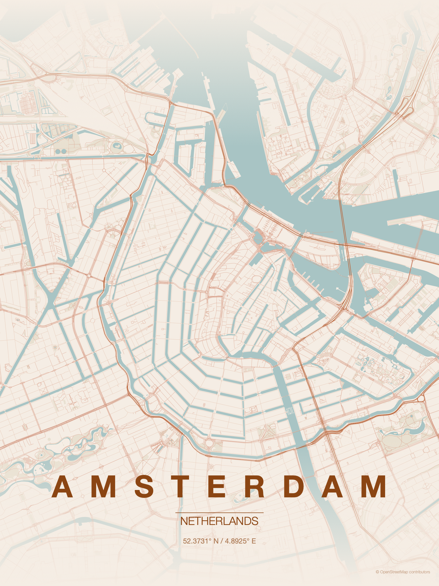

# MapToPoster for macOS

A native macOS (SwiftUI) app that turns any city into a beautiful, minimalist
map poster. It's a native reimplementation of
[originalankur/maptoposter](https://github.com/originalankur/maptoposter) — same
themes, same layout, same typography — but with a live GUI instead of a Python CLI,
and no Python/matplotlib/OSMnx dependencies.

Type a city, pick a theme, and press **Generate**. The map data comes straight
from OpenStreetMap.



## How it works

| Step | Original (Python) | This app (native Swift) |
|------|-------------------|--------------------------|
| Geocoding | Nominatim (geopy) | Nominatim REST API |
| Map data | OSMnx | Overpass API (direct) |
| Rendering | matplotlib | Core Graphics / AppKit |

The renderer reproduces the original's math exactly: the `compensated_dist`
viewport crop, the road hierarchy (motorway → residential) with the same colors
and line widths, water/park polygon layers, top & bottom gradient fades, and the
title / country / coordinates / separator / attribution typography block.

## Settings

Everything the original CLI exposes, plus a few native extras:

- **City** & **Country** — geocoded to coordinates automatically
- **Manual coordinates** — override geocoding with an exact lat/long
- **Distance** — map radius in meters (4,000–20,000)
- **Theme** — all 17 original themes (Terracotta, Noir, Midnight Blue, Blueprint,
  Neon Cyberpunk, Warm Beige, Pastel Dream, Japanese Ink, Emerald City, Forest,
  Ocean, Sunset, Autumn, Copper Patina, Monochrome Blue, Gradient Roads,
  Contrast Zones)
- **Width** / **Height** — poster size in inches (4–20)
- **Resolution** — render DPI (72–300; original saves at 300)
- **Display city / Display country** — custom label text (e.g. `東京`),
  with automatic Latin vs. non-Latin handling (uppercase + letter-spacing for
  Latin scripts, natural spacing for CJK/Arabic/etc.)
- **Font** — any installed font family
- **Layers** — toggle water, parks/green space, and buildings

Theme and style changes re-render instantly from cached data; only changing the
location or distance triggers a new download.

## Build & run

Requires Xcode / Swift toolchain on macOS 13+.

```bash
./build_app.sh           # builds MapToPoster.app
open MapToPoster.app
```

Or run straight from SwiftPM:

```bash
swift run
```

### Headless render (no GUI)

```bash
swift run MapToPoster --test "Amsterdam" "Netherlands" out.png 9000 terracotta
#                              city        country       file  dist  theme
```

## Data & attribution

Map data © OpenStreetMap contributors. Geocoding and tile data are fetched from
the public Nominatim and Overpass APIs — please be mindful of their usage
policies (the app sends an identifying User-Agent and reuses downloaded data
across re-renders).
